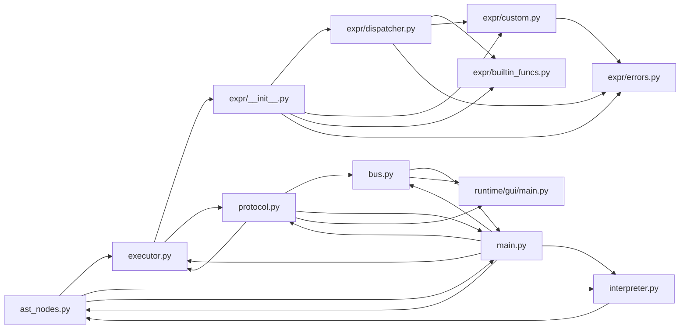

# PDR：阶段三·方法级审计（Method-Level Audit）

> **项目**：Neural Engine（中文文字游戏引擎）
> **阶段**：阶段三前奏（v2 P0 修复已闭环 → 进入 v2 三大功能前）
> **作者**：pdr-analyst
> **日期**：2026-06-25
> **状态**：待 PM / owner 拍板分派
> **前置**：阶段二已完成（plan_b6ef7d9b prior · `fix/phase2-p0-fixes` 已合并 master）
> **审计依据**：[`docs/audit/v2-independent-audit-pm.md`](../audit/v2-independent-audit-pm.md)（code-auditor · 2026-06-24 · 三视角独立审计：架构 / 安全 / 工程化）
> **基线报告**：[`docs/audit/phase1-baseline.md`](../audit/phase1-baseline.md) + [`docs/audit/phase2-summary.md`](../audit/phase2-summary.md)
> **路线图**：[`docs/ROADMAP.md`](../ROADMAP.md)（v0+v1 完工 + 阶段二 P0 修复，阶段三 v2 三大功能待启动）

---

## 1. 背景与动机

### 1.1 阶段一/二做了什么

| 阶段 | 任务 | 性质 |
|---|---|---|
| **阶段一** | v1 偏差 D1/D2/D4/D5 修复 + baseline 报告（90% 覆盖率 / 208 测试 / ruff 31 errors） | 代码级 bug 修复 |
| **阶段二** | v2 独立审计识别 4 P0 / 15 P1 / 9 P2，修复 5 个 P0 + 1 个阶段一并入的 P0-E2（共 6 个 commit） | 代码级 bug 修复 + 文档同步 |

阶段一/二的共同特征：**"代码级"审计**——挑出具体的行号、具体的偏差、具体的修复点。

### 1.2 阶段三前奏要做什么

阶段三的核心是 **v2 三大功能**（PyQt6 GUI / 章节加载器 / 存档读档，详见 ROADMAP §3 P0）。在动手写功能代码之前，需要一次 **"方法级"审计**——从"修 bug"升级到"理解系统"：

- 当前 6 个 P0 修复（阶段一+二）都是 **"在已有结构上修 bug"**——代码可读、可测、可推。
- 阶段三要做的 **"在已有结构上写新功能"**——需要回答"哪里是 v2 的关键钩子"。
- 一次性"看清楚"远比"边写边发现"便宜——尤其是进程边界、扩展点这种"一旦写错就得重写"的位置。

**核心目标**：从代码级审计升级到方法级审计，输出 **运行时信息流图 + 模块依赖图 + 预留接口清单 + public API 清单**，让 v2 三大功能（章节加载器 / PyQt6 GUI / 存档）能精准插入、不破坏现状。

### 1.3 与阶段一/二的差异化定位

| 维度 | 阶段一/二（代码级） | 阶段三前奏（方法级） |
|---|---|---|
| **目标** | 修具体 bug | 看清系统全貌 |
| **产出** | commit + 偏差表 | 信息流图 + 依赖图 + 扩展点清单 + API 清单 |
| **方法** | grep 行号 + 静态对照 | 跨模块追踪 + Mermaid 图示 + 接口定义 |
| **使用者** | tdd-coder（按 commit 修） | tdd-coder（按接口接入）+ PM（排期）+ owner（拍板） |
| **完成标志** | ruff 错误 -1 / 测试 +79 | 4 类产出物全部落 `docs/audit/phase3-method-audit/` 目录 |

---

## 2. 目标

| 优先级 | 子目标 | 度量 |
|---|---|---|
| **P0** | 运行时信息流图（Mermaid flowchart）落盘 | `docs/audit/phase3-method-audit/01-info-flow.md` 含可渲染 Mermaid |
| **P0** | 模块依赖图（Mermaid graph + 表格）落盘 | `docs/audit/phase3-method-audit/02-module-deps.md` |
| **P0** | 预留接口清单（每个接口：signature / 接入点 / 用例 / v2 怎么用）落盘 | `docs/audit/phase3-method-audit/03-extension-points.md` |
| **P0** | public API 清单（每个 API：用途 / 调用方 / 测试覆盖）落盘 | `docs/audit/phase3-method-audit/04-public-api.md` |
| **P0** | 状态空间 + 进程边界附录（NEXT 三阶段 / multiprocessing / 命名空间） | `docs/audit/phase3-method-audit/05-state-and-process.md` |
| **P1** | 6 维度全部交叉校验无矛盾 | 与 ADRs (0001-0004) + ROADMAP §3 + v2 审计 §3.2 的一致性 |
| **P1** | 标注"待确认"项（用户拍板才能定的小决策） | 写入 `06-open-questions.md` |

**不做的事**：不修改 `src/` 下任何代码、不动 fix 分支、不写实现代码——纯审计 + 文档。

---

## 3. 范围

### 3.1 包含（In Scope）—— 6 个审计维度

| 维度 | 覆盖范围 | 主参考 |
|---|---|---|
| **运行时信息流** | CLI argv → `_load_story` → `extract_neon_blocks` → `parse_block_skeleton` → `parse_block_meta` + `parse_next_decls` + `parse_block_body` (含 `parse_if_stmt` 5 形态 + `parse_decorator`) → `Block` AST → `Executor.run` → `_execute_block_loop` → `run_block` (9 节点 dispatch) → `_execute_if` → `dispatcher.eval_bool` → 事件广播 → `EngineBus.put_evt` → JSON → `multiprocessing.Queue` → GUI `bus.get_evt` → 渲染 | ADR-0001 §7 + ADR-0004 §3 + v2 审计 §3.2 |
| **模块依赖图** | `src/core/engine/` 8 个文件 + `src/core/engine/expr/` 6 个文件 + `src/runtime/gui/main.py` 之间的 import 关系；明确无循环依赖；标注 CONTEXT 边界（core / editor / runtime） | v2 审计 §3.2 验证无环 + ADR-0003 §2 决策 2 |
| **预留扩展点** | `CustomExecutor.register_function`（剧情自定义函数）/ `register_evaluator`（自定义表达式 - `@LLM-jud` 钩子）/ `BUILTIN_FUNCS` 注释行 v2+ 扩展位 / `EventSink` Protocol（替换 Bus 的替代渲染器）/ `_try_spawn_gui`（切换 GUI 子进程）/ `DecoratorEvt` call vs stop（P1-A6 改造位）/ `runtime/__init__.py`（Save/Load/Audio/Video 预留）/ `core/decorators/__init__.py`（修饰器运行时钩子） | ADR-0003 §3.3 + ADR-0004 §3.4 F4 + v2 审计 P2-A2 + ROADMAP §3.7 |
| **public API** | `core.engine.ast_nodes` (17 dataclasses + ParserError) / `core.engine.bus` (EngineBus + 3 helper) / `core.engine.executor` (Executor + GameState + EventSink/MemoryEventSink/MemoryInputSink) / `core.engine.interpreter` (7 解析函数 + 3 dataclass) / `core.engine.main` (main + _load_story + _try_spawn_gui) / `core.engine.protocol` (3 cmd + 6 evt + parse_cmd/parse_evt) / `core.engine.expr` (ExprDispatcher + CustomExecutor + ExprError + UnsupportedNodeError + BUILTIN_FUNCS) / `runtime.gui.main` (main) | `src/core/engine/expr/__init__.py` 已有的 `__all__` + 各文件 import 关系 |
| **进程边界** | `multiprocessing.Queue` (default) vs `queue.Queue` (test injection via `use_multiprocessing=False`) / JSON 序列化 (`bus.put_evt` 用 `json.dumps` + UTF-8) / GUI 子进程 spawn (`_try_spawn_gui` + `subprocess.Popen`) / `EngineBus.close` + `_drain` + `_close_queue` / main 不读 cmd_q（v0 简化，详见 ADR-0002 D-main） | ADR-0001 §7 + ADR-0002 D-main + v2 审计 §4.1 P0-S1 |
| **状态空间** | `GameState.vars` (str→Any) / `GameState.path` (历史节点) / `GameState.next_table` (块内 var→target_id 临时表) / ID 命名空间 (`IdMeta.id` 元数据区) / 变量命名空间（块内 in 变量 + next 变量名）/ NEXT 三阶段（声明 → 竞争 → end 锁定，`Executor.next: tuple[var_name, target_id]`） / 修饰器块级状态（`_deco_state: dict[name, dict[key, val]]`，块入口清空） | ADR-0001 §1 + §5 + ADR-0002 D1-confirmed + v2 审计 §3.3 D1 |

### 3.2 不包含（Out of Scope）—— 明确推后

- **不动 src/** —— 阶段三前奏是 audit/PDR 任务，不写代码
- **不动 fix 分支** —— 在 master 上工作，不创建 fix/phase3-method-audit 分支（产出物仅文档）
- **不修任何 v2 P1 / P2 项** —— 见 v2 审计 §6.2 + 阶段二 §6.3 T1-T10（阶段三+ 处理）
- **不写 v2 三大功能实现** —— PyQt6 GUI / 章节加载器 / 存档读档的代码实现属于阶段三后续 PDR
- **不写新 ADR** —— 方法级审计输出物是"理解当前系统"，不引入新决策；若需新决策，归 ADR-0005+ 单独拍板
- **不跑测试 / 不动 ruff** —— 文档任务，不回归

### 3.3 行为约束

- **不修改任何源码** —— 仅 `docs/audit/phase3-method-audit/` 下新增 6 个 markdown 文件
- **不动 master 分支上的 src/** —— 仅 `docs/` 子目录新增
- **所有 Mermaid 图必须可渲染** —— owner 在 GitHub / VSCode preview 能直接看
- **接口定义明确指向"v2 怎么用"** —— 每个扩展点必须有一段"v2 use case"

---

## 4. 产出格式定义（4+1 类）

### 4.1 产出 1：运行时信息流图（Mermaid flowchart）

**文件名**：`docs/audit/phase3-method-audit/01-info-flow.md`

**结构**：

```markdown
# 运行时信息流（Runtime Information Flow）

> 端到端追踪：从 user input 到 GUI 渲染的完整数据 / 控制流。

## 总览图（Mermaid flowchart）

```mermaid
flowchart TD
    User([用户]) -->|argv[1]=chapter.md| Main[main.py]
    Main -->|subprocess.Popen| GuiProc[GUI 子进程]
    Main --> Bus[EngineBus]
    Bus -->|JSON via Queue| GuiProc
    GuiProc -->|put_cmd UserInputCmd| Bus
    Main --> Load[_load_story: 路径校验 → read_text]
    Load --> Extract[extract_neon_blocks: 扫 ```neon 围栏]
    Extract --> Skeleton[parse_block_skeleton: 分 meta/body]
    Skeleton --> Meta[parse_block_meta: id:xxx + endX:chapterYY]
    Skeleton --> Next[parse_next_decls: next: / x←next:]
    Skeleton --> Body[parse_block_body: node start...node end]
    Body --> If[parse_if_stmt: 5 形态子解析器]
    Body --> Decor[parse_decorator: bracket-aware split]
    Body --> AST[Block AST]
    AST --> Story[Story]
    Story --> Exe[Executor]
    Exe --> Loop[_execute_block_loop: 跨块 NEXT 跳转]
    Loop --> Block[run_block: 9 节点 dispatch]
    Block --> IfExe[_execute_if → dispatcher.eval_bool]
    IfExe --> Disp[ExprDispatcher]
    Disp --> Se[simpleeval.SimpleEval]
    Disp --> Fallback[CustomExecutor.eval_fallback]
    Se -->|put_evt| Bus
    Fallback -->|put_evt| Bus
    Bus -->|JSON to GUI| GuiProc
```

## 关键链路详解

### 链路 A：用户输入 → 渲染（双向）
1. ...
2. ...

### 链路 B：分支选择 → 跳转（单向）
...
```

**验收**：
- Mermaid flowchart 可在 GitHub 直接渲染（`mermaid` code block）
- 标注每个节点的源文件 + 行号
- 标注每条边的数据形态（dict / bytes / AST node / event dataclass）

### 4.2 产出 2：模块依赖图（Mermaid graph + 表格）

**文件名**：`docs/audit/phase3-method-audit/02-module-deps.md`

**结构**：

```markdown
# 模块依赖图（Module Dependency Graph）

## 总览图（Mermaid graph）



## 表格详表

| 源模块 | 目标模块 | 导入符号 | 位置 |
|---|---|---|---|
| ast_nodes | (无导入) | — | — |
| bus | core.engine.protocol | parse_cmd, parse_evt | bus.py:15 |
| executor | core.engine.ast_nodes | 17 个 dataclass + 3 kind 常量 | executor.py:14-19 |
| executor | core.engine.protocol | 6 个 evt dataclass + UserInputCmd | executor.py:20-24 |
| executor | core.engine.expr | ExprDispatcher, ExprError | executor.py:25 |
| ... | ... | ... | ... |

## 无环验证

按 v2 审计 §3.2 已确认 0 循环依赖。本节列出验证方法 + 当前状态。
```

**验收**：
- Mermaid graph 可渲染
- 表格列出**所有** import 关系（含 `from X import Y` 的具体符号）
- 明确标注 CONTEXT 边界（core / editor / runtime）

### 4.3 产出 3：预留接口清单（Extension Points）

**文件名**：`docs/audit/phase3-method-audit/03-extension-points.md`

**结构**（每条接口一个 section）：

```markdown
# 预留接口清单（Extension Points）

> 列出 v2+ 接入的关键钩子。每个接口包含：signature / 接入点 / 用例 / v2 怎么用。

---

## EP-01: CustomExecutor.register_function

| 项 | 内容 |
|---|---|
| **位置** | `src/core/engine/expr/custom.py:113-120` |
| **signature** | `def register_function(self, name: str, fn: Callable) -> None` |
| **接入点** | 构造 `ExprDispatcher(state, custom=CustomExecutor(state))` 前先 `custom.register_function(...)` |
| **当前用例** | 无生产调用方；`tests/core/test_expr_custom.py` 测试用 `rand_scene` lambda |
| **v2 怎么用** | ROADMAP §3.6 表达式系统增强：`randint(min, max)` / `clamp(val, lo, hi)` 等安全内置函数通过 `register_function` 注入，不污染 `BUILTIN_FUNCS` 引擎内置语义 |

```python
# v2 用法示例
custom = CustomExecutor(game_state)
custom.register_function("randint", lambda lo, hi: random.randint(lo, hi))
custom.register_function("clamp", lambda v, lo, hi: max(lo, min(v, hi)))
dispatcher = ExprDispatcher(game_state, custom=custom)
result = dispatcher.eval("randint(1, 6) == 6")  # 受控随机
```

| **风险** | LOW — 回调函数被 simpleeval 当 builtin 调用 |
| **测试覆盖** | `tests/core/test_expr_custom.py::test_register_function_*` |

---

## EP-02: CustomExecutor.register_evaluator

| 项 | 内容 |
|---|---|
| **位置** | `src/core/engine/expr/custom.py:122-152`（含 P0-S2 ReDoS 防护） |
| **signature** | `def register_evaluator(self, pattern: str, handler: Callable) -> None` |
| **接入点** | simpleeval 失败后 `CustomExecutor.eval_fallback` 按 `_expr_handlers` 顺序匹配正则 |
| **当前用例** | 无生产调用方；`tests/core/test_expr_custom.py` 测试用 `chapter_\d+_done` lambda |
| **v2 怎么用** | ROADMAP §3.7 `@LLM-jud` 装饰器框架：通过 `register_evaluator(r"^@LLM-jud\((.*)\)$", handler)` 把 `@LLM-jud(P-text, 是否积极情感)` 表达式接管，handler 内部异步调用 LLM API + 缓存 |

| **风险** | MEDIUM — P0-S2 ReDoS 防护已加（长度 256 + 危险模式 + 1s 超时），但仍受 Python 3.10/3.11/3.12 线程无法强杀限制（custom.py:111-118） |
| **测试覆盖** | `tests/core/test_expr_custom.py::test_register_evaluator_*` |

---

## EP-03: EventSink Protocol

| 项 | 内容 |
|---|---|
| **位置** | `src/core/engine/executor.py:28-32`（Protocol 定义）+ 实际接口 `{put_evt, get_cmd}` |
| **signature** | `class EventSink(Protocol): def put_evt(self, evt) -> None: ...; def get_cmd(self): ...` |
| **接入点** | `Executor(story, sink)` 构造函数注入 |
| **当前用例** | `MemoryEventSink`（测试累积）/ `MemoryInputSink`（测试按序列消费） |
| **v2 怎么用** | ROADMAP §3.1 PyQt6 GUI：实现 `PyQt6Sink(QObject)` 包装 `EngineBus`，把事件 emit 到 GUI 线程，把 GUI 输入映射到 `UserInputCmd.put_cmd`。v2 §3.2 章节加载器：实现 `ChapterManagerSink` 订阅 `RouteEvt` 自动加载新章节 |

| **风险** | LOW — Protocol 抽象隔离稳定，测试用 `MemoryEventSink` 已是范式 |
| **测试覆盖** | `tests/core/test_executor_*.py` 全套用 `MemoryEventSink` / `MemoryInputSink` |

---

## EP-04: BUILTIN_FUNCS 注释行扩展位

| 项 | 内容 |
|---|---|
| **位置** | `src/core/engine/expr/builtin_funcs.py:25-29`（注释标注 v2+ 扩展位） |
| **signature** | 字典常量 `BUILTIN_FUNCS: dict[str, Callable]` |
| **接入点** | 直接修改字典（在 commit 中标注 ADR-XXXX 决策） |
| **当前用例** | 8 个：int / str / float / bool / len / min / max / abs / round |
| **v2 怎么用** | ROADMAP §3.6 表达式系统增强——如果某个函数是"引擎内置"语义（如 `len` 永远是长度），加到 `BUILTIN_FUNCS`；如果是"剧情自定义"语义（如 `randint`），走 `CustomExecutor.register_function` 钩子 |

| **风险** | MEDIUM — 加内置函数扩大 simpleeval 攻击面，必须每加一个函数走 ADR 拍板 + ADR-0004 §4 决策 5 复审 |
| **测试覆盖** | `tests/core/test_expr_dispatcher.py` 全套覆盖 8 个函数 |

---

## EP-05: _try_spawn_gui（GUI 子进程切换）

| 项 | 内容 |
|---|---|
| **位置** | `src/core/engine/main.py:90-100` |
| **signature** | `def _try_spawn_gui() -> subprocess.Popen | None` |
| **接入点** | `main()` 入口第 1 步调用 |
| **当前用例** | `subprocess.Popen([sys.executable, "-m", "runtime.gui.main"], stdout=DEVNULL, stderr=DEVNULL)` —— 始终成功（headless 降级路径） |
| **v2 怎么用** | ROADMAP §3.1 PyQt6 GUI：保持同一 subprocess 启动方式，但 `runtime.gui.main` 内 `importlib.util.find_spec("PyQt6")` 切换 CLI 占位 vs QMainWindow 窗口。v2 §3.2 章节加载器：在 GUI 子进程启动时传入 `chapters_dir` 参数，GUI 内部维护 `ChapterManager` |

| **风险** | LOW — 已封装成 Popen 工厂；v2 改造仅替换 GUI 模块内部 |
| **测试覆盖** | `tests/core/test_main_entry.py::test_try_spawn_gui_*`（部分覆盖） |

---

## EP-06: DecoratorEvt call vs stop 区分（P1-A6 改造位）

| 项 | 内容 |
|---|---|
| **位置** | `src/core/engine/executor.py:240-251` `_emit_decorator` + `src/core/engine/protocol.py:151-169` `DecoratorEvt` |
| **signature** | 当前 `DecoratorEvt(name, args: list[str])` —— P1-A6 建议扩 `kind: Literal["call", "stop"]` |
| **接入点** | executor 广播 `DecoratorEvt` 时按 `isinstance(deco, DecoratorCall/Stop)` 区分 |
| **当前用例** | 静默处理（同 P1-A6 描述） |
| **v2 怎么用** | ROADMAP §3.1 PyQt6 GUI：GUI 收到 `DecoratorEvt(kind="call")` 启动 BGM / 渲染样式；收到 `DecoratorEvt(kind="stop")` 停止 BGM / 清样式。当前无区分 → GUI 无法做 |

| **风险** | LOW — `from_dict` 兼容旧 dict（默认 `"call"`），向后兼容 |
| **测试覆盖** | `tests/runtime/test_gui_protocol.py::test_main_ignores_decorator_and_log` |

---

## EP-07: src/runtime/ 预留位（Save/Load/Audio/Video）

| 项 | 内容 |
|---|---|
| **位置** | `src/runtime/__init__.py`（空文件）+ `src/runtime/CONTEXT.md` |
| **signature** | 按 CONTEXT 描述：`SaveManager` / `TextRenderer` / `AudioManager` / `VideoPlayer` / `PlatformBridge` |
| **接入点** | 新建 `src/runtime/save.py` / `audio.py` 等子模块，`SaveCmd` / `LoadCmd` 通过 `protocol.py` 走 EngineBus |
| **当前用例** | 无 |
| **v2 怎么用** | ROADMAP §3.3 存档 / 读档：`SaveManager.save(slot, game_state)` → JSON 文件；`LoadManager.load(slot)` → 恢复 `state.vars` + 当前块位置。ROADMAP §3.6-§3.8：音频视频由 `@style bgm:` / `@style bgm_stop` 触发，订阅 `DecoratorEvt` |

| **风险** | LOW — 目录已留 + CONTEXT.md 已定义术语表 |
| **测试覆盖** | 无（占位） |

---

## EP-08: src/core/decorators/ 修饰器运行时钩子预留位

| 项 | 内容 |
|---|---|
| **位置** | `src/core/decorators/__init__.py`（空文件，仅占位） |
| **signature** | 按 ADR-0003 §2 决策 2 描述：修饰器运行时钩子（与表达式平行） |
| **接入点** | 当前 `@style` 是装饰器调用语法（`DecoratorCall` AST 节点），executor 广播 `DecoratorEvt`，**实际运行时钩子未实现** |
| **当前用例** | 无（v0 仅广播事件，无 GUI 真渲染） |
| **v2 怎么用** | ROADMAP §3.1 PyQt6 GUI 实现"真渲染"时，按 ADR-0003 §2 设计在 `src/core/decorators/style.py` 注册 `@style` 的运行时钩子（按 key/val 解析 → 调用 GUI 的 `AudioManager.play(bgm=...)` / `TextRenderer.set_style(...)`） |

| **风险** | MEDIUM — 当前 `DecoratorEvt.args` 是 `list[str]`，结构化参数 `[item1,item2]`（ADR-0004 G5）落地后钩子实现复杂度上升 |
| **测试覆盖** | 无（占位） |
```

**验收**：
- 每个接口包含：位置（含行号）/ signature / 接入点 / 当前用例 / v2 怎么用 / 风险 / 测试覆盖 7 项
- 标注 ROADMAP §3 对应的 v2 use case
- 至少 6 个接口（EP-01 ~ EP-08 中 6-8 个）

### 4.4 产出 4：public API 清单

**文件名**：`docs/audit/phase3-method-audit/04-public-api.md`

**结构**（按模块组织）：

```markdown
# public API 清单

> 按模块列出所有"对外可见"的符号（不以下划线开头）。每个 API：用途 / 调用方 / 测试覆盖。

---

## 模块：core.engine.ast_nodes

| API | 用途 | 调用方 | 测试覆盖 |
|---|---|---|---|
| `IdMeta` | 元数据区 ID 节点 | interpreter / executor / main | 100% |
| `IdStart` | 元数据区 ID 起点 sentinel | interpreter / executor | 100% |
| `IdEnd` | 元数据区 ID 终点（含路由章节） | interpreter / executor / main | 100% |
| `BlockLocation` | 块位置（lineno + col） | interpreter / ast_nodes | 100% |
| `NextDecl` | next 声明（var_name 可选 + target_id） | interpreter / executor | 100% |
| `Block` | 块 AST（meta + next_table + body + loc） | executor / main | 100% |
| `Story` | 整个章节 AST（blocks） | executor / main | 100% |
| `Start` | 块入口 sentinel | executor | 100% |
| `End` | 块出口 sentinel | executor | 100% |
| `Text` | 文本行节点 | executor | 100% |
| `In` | 用户输入节点 | executor | 100% |
| `Echo` | 变量输出节点（含 v1 拼接） | executor | 100% |
| `NextId` | 显式跳转节点 | executor | 100% |
| `CallExpression` | 分支项简写（echo / in） | interpreter / executor | 100% |
| `Branch` | if 分支项（value + target） | interpreter / executor | 100% |
| `If` | 条件节点（cond + branches） | interpreter / executor | 100% |
| `DecoratorCall` | 修饰器调用节点 | interpreter / executor | 100% |
| `DecoratorStop` | 修饰器休止符节点 | interpreter / executor | 100% |
| `VAR_KIND` / `EXPR_KIND` / `BOOL_EXPR_KIND` | If.cond kind 常量 | interpreter / executor | 100% |
| `START` / `END` / `ID_START` | sentinel 单例 | interpreter / executor | 100% |
| `ParserError` | 解析期语法错误 | interpreter / main | 100% |

## 模块：core.engine.bus

| API | 用途 | 调用方 | 测试覆盖 |
|---|---|---|---|
| `EngineBus(cmd_q, evt_q, *, use_multiprocessing)` | 双向 Queue + JSON 序列化封装 | main / runtime.gui.main | 100%（37 stmts / 0 missed） |

> 注：内部 `_drain` / `_close_queue` 是 private（`_` 前缀），不算 public API。

## 模块：core.engine.executor

| API | 用途 | 调用方 | 测试覆盖 |
|---|---|---|---|
| `EventSink` | 事件 sink Protocol | executor / tests | N/A（Protocol） |
| `MemoryEventSink` | 测试用内存 sink | tests | 100% |
| `MemoryInputSink` | 测试用输入 sink（按序消费） | tests | 100% |
| `GameState` | 执行期状态（vars / path / next_table） | executor / expr.dispatcher | 100% |
| `Executor` | 主执行器（run / run_block / _execute_if / ...） | main / tests | 89% |

## 模块：core.engine.interpreter

| API | 用途 | 调用方 | 测试覆盖 |
|---|---|---|---|
| `NeonBlock` | 围栏块（lineno + content + raw） | main | 100% |
| `BlockSkeleton` | 块级骨架（meta_lines + body_lines） | main | 100% |
| `BlockMeta` | 元数据区解析结果 | main | 100% |
| `extract_neon_blocks` | 扫 ```neon 围栏 | main / tests | 100% |
| `parse_block_skeleton` | 分 meta_lines + body_lines | main / tests | 95% |
| `parse_block_meta` | 元数据区 id: + endX:chapterYY 解析 | main / tests | 100% |
| `parse_next_decls` | next 声明解析 + 互斥校验 | main / tests | 100% |
| `parse_block_body` | 块内执行区解析 | main / tests | 100% |
| `parse_if_stmt` | node if 5 形态解析 | main / tests | 95% |
| `parse_decorator` | @xxx 修饰器行解析 | main / tests | 100% |

> 注：私有 helper（`_parse_*`）不算 public API。

## 模块：core.engine.main

| API | 用途 | 调用方 | 测试覆盖 |
|---|---|---|---|
| `main(chapter_path)` | 引擎进程入口 | `python -m core.engine.main` | 70% |
| `_load_story(chapter_path)` | 加载章节 → Story | main / tests | 100% |
| `_try_spawn_gui()` | spawn GUI 子进程 | main / tests | 部分 |

> 注：`_load_story` / `_try_spawn_gui` 虽以下划线开头，但实际被 `tests/core/test_main_entry.py` 直接调用，等同 public。

## 模块：core.engine.protocol

| API | 用途 | 调用方 | 测试覆盖 |
|---|---|---|---|
| `LoadChapterCmd` | GUI→Engine 加载章节命令 | bus / main / tests | 100% |
| `UserInputCmd` | GUI→Engine 用户输入命令 | bus / executor / runtime.gui / tests | 100% |
| `ShutdownCmd` | GUI→Engine 优雅退出 | bus / tests | 100% |
| `parse_cmd(d)` | 按 d["cmd"] 分发到对应 dataclass | bus / tests | 100% |
| `TextEvt` | Engine→GUI 文本事件 | executor / runtime.gui / tests | 100% |
| `PromptInputEvt` | Engine→GUI 输入请求事件 | executor / runtime.gui / tests | 100% |
| `DecoratorEvt` | Engine→GUI 修饰器广播事件 | executor / runtime.gui / tests | 100% |
| `RouteEvt` | Engine→GUI 章节路由事件 | executor / runtime.gui / tests | 100% |
| `ChapterEndEvt` | Engine→GUI 章节结束事件 | executor / runtime.gui / tests | 100% |
| `LogEvt` | Engine→GUI 日志事件 | executor / main / runtime.gui / tests | 100% |
| `parse_evt(d)` | 按 d["event"] 分发到对应 dataclass | bus / tests | 100% |

## 模块：core.engine.expr

| API | 用途 | 调用方 | 测试覆盖 |
|---|---|---|---|
| `ExprDispatcher` | 表达式求值调度器（simpleeval → fallback） | executor | 100% |
| `CustomExecutor` | simpleeval fallback + 业务钩子 | executor / tests | 93% |
| `ExprError` | 表达式求值错误基类 | executor / expr | 100% |
| `UnsupportedNodeError` | simpleeval 不支持节点信号 | expr | 100% |
| `BUILTIN_FUNCS` | 函数白名单常量（8 个） | dispatcher | 100% |

## 模块：runtime.gui.main

| API | 用途 | 调用方 | 测试覆盖 |
|---|---|---|---|
| `main(bus=None)` | GUI 主循环（CLI 占位） | `_try_spawn_gui` subprocess / tests | 88% |

---

## 公共 API 总览（速查）

| 模块 | public 数 | 100% 覆盖 | 备注 |
|---|---|---|---|
| core.engine.ast_nodes | 23（20 类 + 3 sentinel + ParserError） | 23 | dataclass 全部 |
| core.engine.bus | 1（EngineBus） | 1 | |
| core.engine.executor | 5（4 类 + 1 Protocol） | 4（Protocol N/A） | Executor 89% |
| core.engine.interpreter | 13（3 类 + 10 函数） | 8 | 解析函数多数 100% |
| core.engine.main | 3（main + 2 helper） | 1 | main 70% |
| core.engine.protocol | 11（3 cmd + 6 evt + 2 parse） | 11 | |
| core.engine.expr | 5 | 4 | CustomExecutor 93% |
| runtime.gui.main | 1 | 0 | 88% |
| **合计** | **62** | **54** | |
```

**验收**：
- 列出**所有** `from X import Y` 中非 `_` 前缀的 Y
- 每个 API 标注：用途（1 句话）/ 调用方（具体模块）/ 测试覆盖（% 或 100%/无）
- 末尾有"总览速查表"
- 覆盖度数据来自阶段二 §5.3 阶段二最终覆盖率报告

### 4.5 产出 5（附录）：状态空间 + 进程边界

**文件名**：`docs/audit/phase3-method-audit/05-state-and-process.md`

**结构**：

```markdown
# 状态空间 + 进程边界附录

## 1. 状态空间

### 1.1 GameState（executor.py:63-68）

| 字段 | 类型 | 生命周期 | v2 关注点 |
|---|---|---|---|
| `vars` | `dict[str, Any]` | 跨块持续（隐式全局） | ROADMAP §3.5 变量持久化语义明确（`global` / `local`） |
| `path` | `list` | 当前未使用（v0 占位） | ROADMAP §3.3 存档需记录路径 |
| `next_table` | `dict[str, str]` | 块入口重置（var_name → target_id） | 仅块内临时，跨块需重新声明 |

### 1.2 NEXT 三阶段（ADR-0001 §5.1-5.3）

| 阶段 | 数据 | 位置 |
|---|---|---|
| **声明** | `Block.next_table: tuple[NextDecl, ...]`（var_name + target_id） | interpreter AST |
| **竞争** | `Executor.next: tuple[var_name, target_id]` + 块入口重置 | executor 运行时 |
| **应用** | `run_block` 末尾 `self._handle_end(block)` → 查 `self.next` → `_next_block(current)` | executor 调度 |

### 1.3 ID 命名空间 vs 变量命名空间（ADR-0001 §1）

| 命名空间 | 字段 | 位置 | 例子 |
|---|---|---|---|
| **ID 命名空间** | `IdMeta.id` | 元数据区 | `id:c1` |
| **变量命名空间** | `In.var` / `Echo.var` / `NextDecl.var_name` | 块内执行区 + 元数据区 next | `node in → P-text` / `pick ← next : ca` |

**关键不变量**（ADR-0001 §11 不变量 #1）：
- `id:xxx` **只能**在 `node start` 之前的元数据区
- 块内 `node start` 与 `node end` 之间的所有标识符都属变量命名空间
- `c1` 和 `c11` 在变量命名空间内无本质区别

### 1.4 修饰器块级状态（ADR-0002 D1-confirmed）

| 项 | 内容 |
|---|---|
| **位置** | `executor.py:83` `self._deco_state: dict = {}` |
| **作用域** | 块级（不跨块继承） |
| **清空时机** | `run_block` 入口（`node start` 之后立即），**不是** `node end` 时（ADR-0002 D1-confirmed） |
| **结构** | `{decorator_name: {key: value}}` |
| **GUI 已知 limitation** | `DecoratorEvt` 不区分 call vs stop（v2 审计 P1-A6，ROADMAP §3.1 PyQt6 GUI 上线后暴露） |

---

## 2. 进程边界

### 2.1 双向 Queue + JSON 序列化

```
GUI 进程              multiprocessing.Queue              Engine 进程
┌────────┐                                            ┌────────┐
│        │ ── UserInputCmd (JSON bytes) ────────────→ │        │
│ get_evt│                                            │ get_cmd│
│ put_cmd│                                            │ put_evt│
│        │ ←── TextEvt (JSON bytes) ────────────────── │        │
└────────┘                                            └────────┘
```

- **默认**：`multiprocessing.Queue`（`EngineBus(use_multiprocessing=True)`）
- **测试注入**：`queue.Queue`（`EngineBus(use_multiprocessing=False)` 或直接传 `cmd_q=queue.Queue()`）
- **序列化**：`json.dumps(cmd.to_dict()).encode("utf-8")`（`bus.py:40`）

### 2.2 GUI 子进程 spawn

```
Engine 进程                                          GUI 子进程
main.py                                               runtime.gui.main
  ↓ subprocess.Popen([sys.executable, "-m", "runtime.gui.main"])
  ↓ stdout=DEVNULL, stderr=DEVNULL
spawn ───────────────────────────────────────────────→ 启动 CLI 占位 / PyQt6 窗口
  ↓
bus = EngineBus(use_multiprocessing=True)
```

- **位置**：`main.py:90-100` `_try_spawn_gui`
- **降级路径**：`FileNotFoundError` → 返回 None → bus 广播 `LogEvt(level="warning", message="GUI not available, running headless")`
- **v2 改造位**：ROADMAP §3.1 PyQt6 GUI 内部 `importlib.util.find_spec("PyQt6")` 切换 CLI/QMainWindow

### 2.3 main 不读 cmd_q（v0 简化）

- **现状**：`main.py:103-173` `main()` 函数加载章节 + 跑 Executor，**不监听 cmd_q**
- **影响**：`LoadChapterCmd` / `ShutdownCmd` 当前仅是 schema 文档，无消费方（ADR-0002 D-main）
- **v2 改造位**：ROADMAP §3.2 章节加载器需要 `LoadChapterCmd` 消费（GUI 主动加载新章节）

### 2.4 _drain / _close_queue 边界

| 函数 | 行为 | 已知 limitation |
|---|---|---|
| `_drain(q)` | 排空 q 中残留消息（非阻塞） | v2 审计 P1-S2：当前 `except (_thread_queue.Empty, Exception)` 吞咽所有异常——`_thread_queue.Empty` 是 `Exception` 子类，第二分支命中所有 |
| `_close_queue(q)` | 关闭 q（multiprocessing.Queue 有 .close()；queue.Queue 无） | 鸭子类型判断（`hasattr(q, "close") and callable` + `not isinstance(q, _thread_queue.Queue)`） |

### 2.5 路径校验（阶段二 P0-S1）

- **位置**：`main.py:35-66` `_load_story`
- **5 项校验**：raw.is_symlink → resolve → relative_to CHAPTERS_ROOT → .md 后缀 → ≤ 1MB
- **常量**：`main.py:31` `CHAPTERS_ROOT = Path(__file__).resolve().parent.parent.parent.parent / "chapters"`
- **影响**：v2 章节加载器不能复用 `main._load_story`（设计为"单章节加载"），需写新 `ChapterManager.load_chapter(target_name)`
```

**验收**：
- 状态空间 4 个子节（GameState / NEXT 三阶段 / ID vs 变量命名空间 / 修饰器块级状态）
- 进程边界 5 个子节（Queue / 子进程 / cmd_q / drain / 路径）
- 每节标注 v2 改造位

---

## 5. 验收标准

### 5.1 硬性验收（必须达成）

1. **6 个产出文件落盘**：
   - `docs/audit/phase3-method-audit/01-info-flow.md`（含 Mermaid flowchart）
   - `docs/audit/phase3-method-audit/02-module-deps.md`（含 Mermaid graph + 表格）
   - `docs/audit/phase3-method-audit/03-extension-points.md`（≥ 6 个接口）
   - `docs/audit/phase3-method-audit/04-public-api.md`（≥ 50 个 public API）
   - `docs/audit/phase3-method-audit/05-state-and-process.md`（状态 + 进程边界）
   - `docs/audit/phase3-method-audit/06-open-questions.md`（待确认项）
2. **Mermaid 图可渲染**：owner 在 GitHub / VSCode preview 直接可见，无 syntax error
3. **每个接口 / API 标注测试覆盖度**：100% / 89% / 70% / N/A 等明确数字（数据来自阶段二 §5.3 报告）
4. **每个接口标注 v2 改造位**：明确引用 ROADMAP §3 的具体小节（如 §3.1 / §3.2 / §3.3 / §3.6 / §3.7）
5. **不动 src/**：git diff `src/` 为空
6. **不动 master 分支**：在 master 上直接落文档，不创建 fix 分支

### 5.2 软性验收（建议达成）

- 06-open-questions.md 至少 3 条"待 PM/owner 拍板"的小决策（如 v2 chapter02 是相对路径还是绝对？存档 slot 是文件名还是 UUID？）
- 04-public-api.md "总览速查表"覆盖率总览
- 03-extension-points.md 每个 EP 标注"风险等级"（LOW / MEDIUM / HIGH）
- 跨文档交叉引用一致（如 EP-05 `_try_spawn_gui` 在 05-state-and-process.md §2.2 也提到）

### 5.3 失败定义

- 产出文件缺失 → 任务失败
- Mermaid 语法错 → 渲染失败
- 测试覆盖度无数据来源标注 → 不通过
- 引用 ROADMAP 小节错位 → 不通过

---

## 6. 风险与依赖

### 6.1 风险

| 风险 | 等级 | 缓解 |
|---|---|---|
| **审计遗漏 v2 关键扩展点** | MEDIUM | 用 ROADMAP §3 P0/P1/P2 + ADR-0003 §3 + ADR-0004 §3 倒推所有规划点；EP-08 装饰器运行时钩子按 ADR-0003 §2 决策 2 已留 |
| **Mermaid 复杂度过大渲染失败** | LOW | 单图节点控制在 30 个以内；超过则拆多张子图（如把 interpreter 单独画一张） |
| **覆盖率数据滞后** | LOW | 引用阶段二 §5.3 报告（287 passed / 92% 总覆盖）；若阶段三启动后有变化，标注"待 §5.3 更新" |
| **公共 API 边界争议** | LOW | 遵循"非 `_` 前缀即为 public"惯例；`_load_story` / `_try_spawn_gui` 被测试直接调用算 public（标注） |

### 6.2 依赖

- **上游**：阶段二已完成（plan_b6ef7d9b prior · `fix/phase2-p0-fixes` 已合并 master）
- **下游**：阶段三 v2 三大功能 PDR（PyQt6 GUI / 章节加载器 / 存档）将消费本审计的"扩展点清单"和"公共 API 清单"作为接入契约

### 6.3 不在范围

- **不修任何代码**：本任务是 audit/PDR，不动 src/
- **不写 v2 实现代码**：PyQt6 GUI / 章节加载器 / 存档读档的代码实现属于阶段三后续 PDR
- **不写新 ADR**：方法级审计是"理解当前系统"，不引入新决策；若有新决策，归 ADR-0005+ 单独拍板

---

## 7. 不变量守护

| 不变量 | 守护手段 |
|---|---|
| **不修改 src/** | git diff 阶段三结束时 `src/` 必须为空 diff |
| **不创建 fix 分支** | 在 master 上直接落文档；如需 commit 记录信息，单一 commit `docs(phase3): 方法级审计产出物` |
| **不引入新决策** | 6 个产出文件仅描述现状 + ROADMAP 已规划项；不写"建议改成 X"这类决策语言 |
| **Mermaid 可渲染** | 每张图加注释"GitHub / VSCode preview 验证"；写完后跑一次 mermaid-cli 或在线预览 |
| **公共 API / 扩展点 / 状态空间 / 进程边界 4 维度交叉一致** | 03-extension-points.md EP-05 ↔ 05-state-and-process.md §2.2 都提到 `_try_spawn_gui`；03 EP-03 ↔ 05 §2 都提到 `EventSink` Protocol |

---

## 8. 成功标准（一句话）

**6 个产出文件全部落盘、Mermaid 可渲染、≥ 6 个扩展点 + ≥ 50 个 public API + 状态 / 进程边界 4 维度全覆盖、与 ROADMAP §3 改造位对齐——v2 三大功能（PyQt6 GUI / 章节加载器 / 存档）能据此精准插入。**

---

## 9. Open Questions（待 PM/owner 拍板）

> 写入 `docs/audit/phase3-method-audit/06-open-questions.md`。

| # | 问题 | 影响 | 建议 |
|---|---|---|---|
| OQ-1 | v2 章节加载器用相对路径（CHAPTERS_ROOT 拼接）还是绝对路径（GUI 传）？ | `_load_story` 当前只支持相对路径校验；ROADMAP §3.2 章节加载器需新接口 | 推相对路径（与 P0-S1 一致） |
| OQ-2 | 存档 slot 是文件名（`save_01.json`）还是 UUID（`a1b2c3...json`）？ | `runtime/save.py` 设计 | 推文件名 + 序号（玩家可读） |
| OQ-3 | 跨章节变量传递：变量随章节保留还是每章节重置？ | `GameState.vars` 生命周期 | 推保留（隐式全局已实现，仅文档化） |
| OQ-4 | `@LLM-jud` 异步调用阻塞引擎循环还是 fire-and-forget？ | ROADMAP §3.7 风险标注 | 推 asyncio.gather + Future（v3 阶段） |
| OQ-5 | `EventSink` Protocol 是否需扩 `close()` 方法？ | 资源清理生命周期 | 推 v2 加 close()（与 EngineBus.close() 对齐） |

---

## 10. 引用与索引

- **ADR-0001**：v0 baseline script spec（命名空间 / NEXT 三阶段 / 协议）
- **ADR-0002**：v0 引擎实现完工记录（4 条偏差 / D-main：main 不读 cmd_q）
- **ADR-0003**：v1 表达式子系统架构（ExprDispatcher / CustomExecutor / BUILTIN_FUNCS）
- **ADR-0004**：v1 重构设计（砍 translator / G5 修饰器结构化 / @LLM-jud 远期）
- **ROADMAP.md**：v0+v1+阶段二总结 + 阶段三 v2 三大功能 + ROADMAP §3 P0/P1/P2 全功能规划
- **v2-independent-audit-pm.md**：阶段一/二基线 + 4 P0/15 P1/9 P2 + 无环依赖验证
- **phase1-baseline.md**：阶段一基线报告
- **phase2-summary.md**：阶段二修复总结

---

*哈尼斯 · 2026-06-25 · 阶段三前奏·方法级审计 PDR 待拍板*