# 40 · Issue 依赖图

> **TL;DR**：v0 实施依赖是一条主链——`#23 → #24/#25 → #27 → #28 → #29 → #30/#32 → #31/#33/#34/#36 → #37/#38 → #39 → #40 → #42 → #43/#44`，阶段 1 起可部分并行；v1 子图是独立链——`#52 → #46-49 → #50 → #51`，**#50 是 v1 闭环唯一卡点**。（**全部用 GH issue 编号**——HITL 是 GH #43 / #44 / ADR-0004，不是 v0-issue-20 / 21 / v1-issue-8）

## 依赖图（Mermaid，v0 + v1 双子图）

```mermaid
flowchart LR
    %% v0 subgraph
    P23["#23 仓库骨架"]
    P24["#24 AST"]
    P25["#25 Cmd"]
    P26["#26 Evt"]
    B27["#27 EngineBus"]
    P28["#28 neon 拆分"]
    P29["#29 块级骨架"]
    P30["#30 元数据区"]
    P31["#31 next 声明"]
    P32["#32 块内语句"]
    P33["#33 node if 解析"]
    P34["#34 @xxx 解析"]
    E36["#36 GameState+Executor"]
    E37["#37 核心节点执行"]
    D38["#38 @style 执行"]
    E39["#39 node if 打桩"]
    M40["#40 core main.py"]
    G41["#41 GUI 三路径"]
    F42["#42 fixture+e2e"]
    H43["#43 HITL §11 守护"]
    H44["#44 HITL ADR-0002"]

    P23 --> P24
    P23 --> P25
    P23 --> P26
    P23 --> G41
    P25 --> B27
    P26 --> B27
    B27 --> M40
    P24 --> P28
    P28 --> P29
    P29 --> P30
    P29 --> P32
    P30 --> P31
    P31 --> P33
    P32 --> P33
    P32 --> P34
    P28 --> E36
    P31 --> E36
    E36 --> E37
    P31 --> E39
    E37 --> D38
    E37 --> E39
    D38 --> E39
    E39 --> F42
    M40 --> F42
    P27[M40] --> G41
    F42 --> H43
    F42 --> H44

    %% v1 subgraph (独立链) - 当前状态 2026-06-15
    V52["#52 v1-issue-1 骨架 (DONE)"]
    V46["#46 v1-issue-2 translator (骨架已超额)"]
    V47["#47 v1-issue-3 custom (骨架已超额)"]
    V48["#48 v1-issue-4 dispatcher (骨架已超额)"]
    V49["#49 v1-issue-5 AST 扩 kind"]
    V50["#50 v1-issue-6 executor 接 dispatcher ★ 卡点"]
    V51["#51 v1-issue-7 端到端真分支"]
    V53["#53 父 PRD"]

    V52 --> V46
    V52 --> V47
    V52 --> V48
    V46 --> V49
    V49 --> V50
    V50 --> V51
    V51 -.HITL.-> H44_2["ADR-0004 (v1 完工)"]
    V53 -.父.-> V52

    %% v0 -> v1 桥 (v0 闭环后启动 v1)
    H44 -.v0 闭环后启动 v1.-> V53
```



## v0 串行主链（最短完工路径，已闭环）

```
#23 → #24 → #28 → #29 → #30 → #31 → #36 → #37 → #39 → #42 → #43
                            ↓ #25 #26 可与 #24 并行
                            ↓ #32 在 #29 后可与 #30 并行
                            ↓ #33/#34 在 #32 后并行
                            ↓ #38 在 #37 后可与 #39 并行
```

## v1 串行主链（最短闭环路径）

```
#52 (v1-issue-1 骨架) ─┬→ #46 (translator, 已超额) ─┐
                       ├→ #47 (custom, 已超额) ─────┼→ #49 (AST 扩 kind) → #50 (executor 接入 ★ 卡点) → #51 (端到端) → ADR-0004
                       └→ #48 (dispatcher, 已超额) ─┘
```

**v1 关键观察**：
- **#52 单 commit 完成 4 个 issue 的真实现**——骨架 commit `2a83774` 同时含 translator / custom / dispatcher 的完整实现
- **#50 是 v1 闭环唯一卡点**——`executor._execute_if` 按 `If.cond` kind 分流（`var` 走 v0 / `bool_expr` 走 dispatcher.eval_bool / `range` 走 `lo<=v<=hi`）
- **#51 几乎零成本**——chapter01.md fixture 不动（已有 node if）+ `tests/core/test_executor_if.py` 改名 `*_stub_*` → `*_eval_*` + 加真分支断言
- **总工作量**：~3 个 issue × ~50 行 = 1-2 小时即可 v1 闭环

## 可并行的批次（v0）

| 批次 | 可同时开工 | 说明 |
| --- | --- | --- |
| Batch A | `#23` | 无前置，单点启动 |
| Batch B | `#24` `#25` `#26` `#41` | 都依赖 #23；纯不同模块，并行 |
| Batch C | `#27` | 依赖 #25 + #26（总线需协议就位）|
| Batch D | `#28` | 依赖 #24（AST 节点类型就位）|
| Batch E | `#29` | 依赖 #28 |
| Batch F | `#30` `#32` | 都依赖 #29；元数据 / 块内 分工，并行 |
| Batch G | `#31` | 依赖 #30 |
| Batch H | `#33` `#34` `#36` | #33 依赖 #31 + #32；#34 依赖 #32；#36 依赖 #28 + #31 |
| Batch I | `#37` | 依赖 #36 |
| Batch J | `#38` | 依赖 #37 |
| Batch K | `#39` | 依赖 #37 + #38 + #31 |
| Batch L | `#40` `#41` | #40 依赖 #27 + #37；#41 依赖 #23/#25/#26/#27（早开工）|
| Batch M | `#42` | 依赖 #39（端到端 fixture 需要完整 executor）|
| Batch N | `#43` `#44` | 都依赖 #42（HITL 完工关卡，需 owner）|

## v0 关键检查点

1. **#23 完成**——仓库骨架就位，所有后续 PR 有落地处
2. **#29 完成**——neon 围栏拆出来，解析器可以开始
3. **#31 完成**——next 归一化敲定（不变量 #3 落地的起点）
4. **#36 完成**——Executor 单入口确定（影响 #37 #38 #39 的所有后续）
5. **#39 完成**——v0 唯一跑通路径在引擎侧就绪
6. **#42 完成**——端到端集成测试通过，差 GUI
7. **#43 / #44 完成**（HITL）——v0 完工（需 owner 亲自跑 grep 守护 + 写 ADR-0002）

## v1 关键检查点（2026-06-15 实测状态）

1. ✅ **#52 完成**——v1-issue-1 骨架落地（commit `2a83774`，6 个 .py + 37 用例）
2. ⚠️ **#46/#47/#48 已超额完成**——骨架 commit 内含完整实现，但 GH issue 仍 OPEN（owner 必审查 close）
3. ❌ **#49 OPEN**——`If.cond` 扩 `bool_expr` / `range` 两种 kind（interpreter.py + ast_nodes.py 改 ~30 行）
4. ❌ **#50 OPEN（v1 卡点）**——`executor._execute_if` 接入 `ExprDispatcher`（executor.py 改 ~30 行）
5. ❌ **#51 OPEN**——端到端真分支（test 改名 + 新增真分支断言 ~50 行）
6. ❓ **ADR-0004 HITL**——v1 完工记录（待 owner 拍板）

## 关键设计决策（来自工程笔记）

| 决策 | 来源 |
| --- | --- |
| decorator_state 在 **node start** 时清空（不是 ADR §4.1 写的 "node end"）| v0-issue-15 |
| 包结构 `core.engine`（物理目录 `src/core/engine/`）| v0-issue-1 |
| PyQt6 可选，三路径 GUI | v0-issue-18 |
| 路径 B 默认（CLI fallback）| v0-issue-18 |
| §11 #3 用 `grep -r '"NEXT"' src/` pytest 守护 | v0-issue-20 |
| v1 表达式子系统独立成 `core.engine.expr/` 子包（与 interpreter/executor 平级）| v1-issue-1 |
| 三层兜底（translator→simpleeval→fallback）| v1-issue-1 |
| `("var", name)` v0 形态保留兼容（不进 dispatcher）| v1-issue-1 / ADR-0003 §2 决策 4 |

→ 相关：[[dashboard]] / [[../50-fixtures/chapter01]] / [[../20-architecture/state-machine#v1-v1-issue-6open-待实现]]