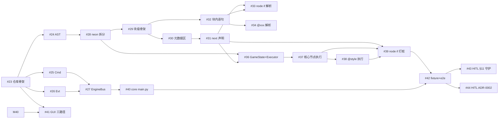

# 40 · Issue 依赖图

> **TL;DR**：v0 实施依赖是一条主链——`#23 → #24/#25 → #27 → #28 → #29 → #30/#32 → #31/#33/#34/#36 → #37/#38 → #39 → #40 → #42 → #43/#44`，阶段 1 起可部分并行。（**全部用 GH issue 编号**——HITL 是 GH #43 / #44，不是 v0-issue-20 / 21）

## 依赖图（Mermaid）



## 串行主链（最短完工路径）

```
#23 → #24 → #28 → #29 → #30 → #31 → #36 → #37 → #39 → #42 → #43
                            ↓ #25 #26 可与 #24 并行
                            ↓ #32 在 #29 后可与 #30 并行
                            ↓ #33/#34 在 #32 后并行
                            ↓ #38 在 #37 后可与 #39 并行
```

## 可并行的批次

| 批次 | 可同时开工 | 说明 |
| --- | --- | --- |
| Batch A | `#23` | 无前置，单点启动 |
| Batch B | `#24` `#25` `#26` `#41` | 都依赖 #23；纯不同模块，并行 |
| Batch C | `#27` | 依赖 #25 + #26（总线需协议就位）|
| Batch D | `#28` | 依赖 #24（AST 节点类型就位）|
| Batch E | `#29` | 依赖 #28 |
| Batch F | `#30` `#32` | 都依赖 #29；元数据 / 块内 分工，并行 |
| Batch G | `#31` | 依赖 #30 |
| Batch H | `#33` `#34` `#36` | #33 依赖 #31 + #32；#34 依赖 #32；#36 依赖 #28 + #31 |
| Batch I | `#37` | 依赖 #36 |
| Batch J | `#38` | 依赖 #37 |
| Batch K | `#39` | 依赖 #37 + #38 + #31 |
| Batch L | `#40` `#41` | #40 依赖 #27 + #37；#41 依赖 #23/#25/#26/#27（早开工）|
| Batch M | `#42` | 依赖 #39（端到端 fixture 需要完整 executor）|
| Batch N | `#43` `#44` | 都依赖 #42（HITL 完工关卡，需 owner）|

## 关键检查点

1. **#23 完成**——仓库骨架就位，所有后续 PR 有落地处
2. **#29 完成**——neon 围栏拆出来，解析器可以开始
3. **#31 完成**——next 归一化敲定（不变量 #3 落地的起点）
4. **#36 完成**——Executor 单入口确定（影响 #37 #38 #39 的所有后续）
5. **#39 完成**——v0 唯一跑通路径在引擎侧就绪
6. **#42 完成**——端到端集成测试通过，差 GUI
7. **#43 / #44 完成**（HITL）——v0 完工（需 owner 亲自跑 grep 守护 + 写 ADR-0002）

## 关键设计决策（来自工程笔记）

| 决策 | 来源 |
| --- | --- |
| decorator_state 在 **node start** 时清空（不是 ADR §4.1 写的 "node end"）| v0-issue-15 |
| 包结构 `core.engine`（物理目录 `src/core/engine/`）| v0-issue-1 |
| PyQt6 可选，三路径 GUI | v0-issue-18 |
| 路径 B 默认（CLI fallback）| v0-issue-18 |
| §11 #3 用 `grep -r '"NEXT"' src/` pytest 守护 | v0-issue-20 |

→ 相关：[[dashboard]] / [[../50-fixtures/chapter01]]